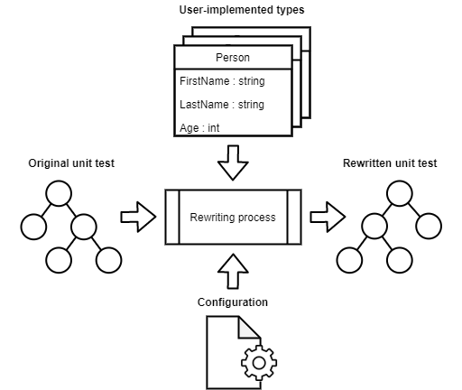

# Structural TestTools


Structural TestTools is a unit test rewriter that reduces would-be compilation errors to simple runtime errors. It allows for testing of types even though members missing or otherwise invalid.

```C#
// Original unit test 
public void Person_AgeInitializesAsZero() {
  Original.Person person = new Original.Person();
  Assert.AreEqual(0, person.Age);
}

// Rewritten unit test on no would-be compilation error
public void Person_AgeInitializesAsZero() {
  Rewritten.Person person = new Rewritten.Person();
  Assert.AreEqual(0, person.Age);
}

// Rewritten unit test on would-be compilation error
public void Person_AgeInitializesAsZero() {
  throw new AssertFailedException("Class Person does not contain member Age");
}
```

See [TDD OPP Kursus](https://github.com/OleVanSanten/tdd-oop-exercises/tree/templated-syntax) for a show case. 

## Overall Process

The tool rewrites syntax trees representing the the original unit tests through type substitution. The rewritting process can be devided into the following steps: 
<br></br>

1. Translating type with <code>ITypeTranslator</code>
2. Verifying translated type with <code>ITypeVerifier</code>
3. Translating member with <code>IMemberTranslator</code>
4. Verifying translated member with <code>IMemberVerifier</code>
5. Modifying syntax tree by substituting types/members with translated types/members

## Configuration
The tool comes comes configured out of the box, however this configuration can easily be fully or partially overwritten. 

### Project-wide configuration
The pre-defined configuration can be overwritten for a whole test project using an XML file. The settings in the configuration can be overwritten one-by-one through including each of them in the XML file. 
```XML
<?xml version="1.0" encoding="utf-8" ?>
<Config>
  <!-- Defining the namespaces from which classes are translated from and to -->
  <FromNamespace>Original</FromNamespace>
  <ToNamespace>Rewritten</ToNamespace>
  
  <!-- Overwritting all rewriting process objects --> 
  <TypeTranslator Type="TestTools.Structure.SameNameTypeTranslator"/>
  <MemberTranslator Type="TestTools.Structure.SameNameMemberTranslator"/>
  <TypeVerifiers>
    <TypeVerifier Type="TestTools.Structure.UnchangedTypeAccessLevelVerifier"/>
    <TypeVerifier Type="TestTools.Structure.UnchangedTypeIsAbstractVerifier"/>
    <TypeVerifier Type="TestTools.Structure.UnchangedTypeIsStaticVerifier"/>
  </TypeVerifiers>
  <MemberVerifiers>
    <MemberVerifier Type="TestTools.Structure.UnchangedFieldTypeVerifier"/>
    <MemberVerifier Type="TestTools.Structure.UnchangedMemberAccessLevelVerifier"/>
    <MemberVerifier Type="TestTools.Structure.UnchangedMemberDeclaringType"/>
    <MemberVerifier Type="TestTools.Structure.UnchangedMemberIsStaticVerifier"/>
    <MemberVerifier Type="TestTools.Structure.UnchangedMemberIsVirtualVerifier"/>
    <MemberVerifier Type="TestTools.Structure.UnchangedMemberTypeVerifier"/>
    <MemberVerifier Type="TestTools.Structure.UnchangedPropertyTypeVerifier"/>
  </MemberVerifiers>
</Config>
```

For structural tests, the XML file is specified for each test (or in a test helper used by each test). 
```C#
TestFactory testFactory = TestFactory.CreateFromConfigurationFile("./TestToolsConfig.xml");
UnitTest test = Factory.CreateTest();
```

For unit tests, the XML must be called "TestToolsConfig.xml" and be placed in the same folder as the project file. 
```
|- TestToolsConfig.xml
|- MyProject.csproj
|- HelloWorld.cs
```

### Type/member-specific configuration
The project-wide configuration can be overwritten for a single type/member using attributes. 

The project-wide TypeTranslator can be overwritten for a single type, if the type is associated with an attribute implementing <code>ITypeTranslator</code>. The following example shows how the default type translation approach can be overwritten. The default approach is to translate the type Customer to another type also called Customer but in a different namespace. The new approach is to translate the type Customer to another type either called Customer or Client in the other namespace. 
```C#
[AlternateNames("Client")]
public class Customer {}
```

The project-wide TypeVerifier can be overwritten in the same way as TypeTranslator. 
```C#
[StaticClass]
public class ArrayHelper {}
```

The project-wide MemberTranslator can be overwritten for a single member, if the member is associated with an attribute implemeting <code>IMemberTranslator</code>. The following shows how the default member translation approach can be overwritten. The default approach is to translate the member CalculateSalary to CalculateSalary on the translated type. The new approach is to translate CalculateSalary to either CalculateSalary or CalculateYearlySalary on the translated type.
```C#
public class Employee {
  [AlternateNames("CalculateYearlySalary")]
  public decimal CalculateSalary() { ... }
}
```

The project-wide MemberVerifier can be overwritten in the same as MemberTranslator. The following shows how the default member verification approach can be overwritten. The default approach is to verify that the field ID stays a field during translation. The new approach is to verify that the field ID is translated into either a field or a property. 
```C#
public class Person {
  [FieldOrProperty]
  public int ID;
}
```
